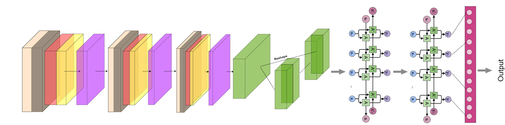

# Keras OCR android application

ML model is based on Keras implementation of Convolutional Recurrent Neural Network for text recognition.
The CRNNs are the combination of two of the most prominent neural networks. They involve CNN(convolutional neural network) followed 
by the RNN(Recurrent neural networks). The proposed network is similar to the CRNN but generates better or optimal results especially
towards audio signal processing and text recognition.

